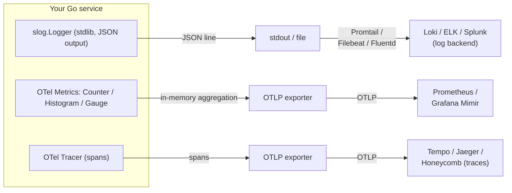

# `obsotel` — Unified Observability Package

The single observability contract for services. Every service imports this package; nothing else. Logs, request IDs, distributed traces, metrics, outbound calls, and error wrapping all flow through these helpers so the AI retrofit has a single, grep-able target.

This is the OTel-augmented layer. It composes a pure-`slog` core (the hidden `internal/obsbase` package) with OpenTelemetry for traces and metrics. Services import only `obsotel`; the core is hidden by Go's `internal/` visibility rule.

**Dependencies:** OTel SDK (`go.opentelemetry.io/otel`, `.../sdk`, `.../trace`, `.../metric`, `.../exporters/stdout/stdouttrace`) + `go.opentelemetry.io/contrib/instrumentation/net/http/otelhttp`. The pure-`slog` core has zero external deps.

**Fail-open principle:** if the OTel collector is down, sampling is off, or the SDK is uninitialized, observability calls do not impact business logic. Business code completes; you lose visibility, not availability.

---

## Quickstart

```go
package main

import (
    "context"
    "log/slog"
    "net/http"
    "os"

    "github.com/YakDa/obsotel"
)

func main() {
    ctx := context.Background()

    // 1. Initialize the OTel tracer (fail-open: returns a no-op shutdown on error).
    shutdown, err := obsotel.InitTracer(ctx, "user-service")
    if err != nil {
        slog.Warn("otel_init_failed", "err", err) // not fatal — service still works
    }
    defer shutdown(ctx)

    // 2. Build a logger. "prod" → JSON; anything else → text.
    log := obsotel.NewLogger(os.Getenv("ENV"))
    slog.SetDefault(log)

    // 3. Wire up HTTP. Handler() wraps mux with otelhttp server span +
    // obsbase logging middleware. LoggingMiddleware calls WithLogger and
    // WithRequestID on each request's context, so handlers downstream get
    // request_id and trace_id injection for free. (slog.SetDefault is
    // still useful as a fallback for goroutines that don't carry the
    // request context — L(ctx)
    // returns slog.Default() when no logger is bound.)
    mux := http.NewServeMux()
    mux.HandleFunc("/foo", fooHandler)
    http.ListenAndServe(":8080", obsotel.Handler(log, mux, "user-service"))
}

func fooHandler(w http.ResponseWriter, r *http.Request) {
    ctx := r.Context()

    if uid := r.Header.Get("X-User-ID"); uid != "" {
        ctx, _ = obsotel.With(ctx, slog.String(obsotel.UserIDKey, uid))
        r = r.WithContext(ctx)
    }

    if err := doStuff(ctx); err != nil {
        obsotel.LogErr(ctx, "do_stuff_failed", err)
        http.Error(w, "internal error", http.StatusInternalServerError)
        return
    }

    w.WriteHeader(http.StatusOK)
}

func doStuff(ctx context.Context) error {
    req, _ := http.NewRequestWithContext(ctx, "GET", "https://api.example.com/x", nil)
    // obsotel.DoRequest uses an internal defaultClient that already has
    // otelhttp client-side tracing and request-ID propagation wired up.
    // For a custom timeout/transport, use NewClient() + DoRequestWithClient.
    resp, err := obsotel.DoRequest(ctx, req)
    if err != nil {
        return obsotel.Wrap(ctx, err, "do_stuff")
    }
    defer resp.Body.Close()
    return nil
}
```

---

## Two-tier architecture

```
┌──────────────────────────────────────────────────────────┐
│  obsotel          (public — what services import)         │
│  - api.go           re-exports the obsbase API            │
│  - logger.go        slog + traceHandler + NewLoggerToWriter│
│                     (obsotel-only; composes obsbase log   │
│                      with the trace/requestID handler chain)│
│  - middleware.go    Handler() = otelhttp + obsbase log    │
│  - client.go        NewClient(), DoRequest, retry         │
│  - tracer.go        InitTracer, Tracer, options           │
│  - metrics.go       Counter, Histogram, prebuilt metrics  │
│  - obsotel_test.go                                       │
└──────────────────────────────────────────────────────────┘
                          │ composes
                          ▼
┌──────────────────────────────────────────────────────────┐
│  internal/obsbase              (hidden — internal/)       │
│  - logger.go, context.go, request_id.go                  │
│  - middleware.go    LoggingMiddleware + statusRecorder   │
│  - outbound.go      DoRequest, DoRequestWithRetry        │
│  - errors.go        AppError, ChainOf, Wrap, LogErr      │
│  - obs_test.go                                             │
└──────────────────────────────────────────────────────────┘
```

`obsotel` is the only import path services should know. The inner `internal/obsbase/` is hidden by Go's `internal/` rule — services cannot import it directly.

---

## File tour

### Public — `obsotel/`

| File | Purpose | Key APIs |
|---|---|---|
| `api.go` | Re-exports of the pure-`slog` core + key constants | `L`, `With`, `WithLogger`, `WithRequestID`, `RequestIDFromContext`, `LogErr`, `Wrap`, `WrapWith`, `NewErr`, `ChainOf`, `AppError`, `ErrorChain`, `RequestIDKey`, `UserIDKey`, `TraceIDKey`, `SpanIDKey` |
| `logger.go` | slog setup + trace + request_id injection | `NewLogger(env)`, `NewLoggerWithLevel(env, level)`, `NewLoggerToWriter(env, level, w)`, `LevelFromString(s)` |
| `middleware.go` | HTTP handler wiring | `Handler(log, next, serviceName)`, `HandlerWithFilter(log, next, serviceName, shouldTrace)` |
| `client.go` | HTTP client + outbound logging + retry | `NewClient()`, `DoRequest(ctx, req)` *(simplified: takes ctx + req, uses internal default client; for custom transport use `DoRequestWithClient`)*, `DoRequestWithClient(...)`, `DoRequestWithRetry(...)`, `DoRequestWithRetryAndClient(...)`, `HTTPError` |
| `tracer.go` | TracerProvider + propagator + span helper | `InitTracer(ctx, name, opts...)`, `Tracer(name)`, `StartSpan(ctx, name)`, `WithSamplingRatio(ratio)`, `WithExporter(exp)` |
| `metrics.go` | OTel counter/histogram helpers + MeterProvider | `NewCounter(name, desc)`, `MustNewCounter`, `NewHistogram(name, desc, unit)`, `MustNewHistogram`, `HTTPRequestDuration`, `HTTPRequestsTotal`, `InitMeter(ctx, name, opts...)`, `WithMeterExporter(exp)` |

### Hidden — `internal/obsbase/`

| File | Purpose | Key APIs |
|---|---|---|
| `logger.go` | slog setup (no OTel) | `NewLogger(env)`, `NewLoggerWithLevel(env, level)`, `LevelFromString(s)` |
| `context.go` | Context-bound logger + request ID | `WithLogger(ctx, l)`, `L(ctx)`, `With(ctx, attrs...)`, `WithRequestID(ctx, id)`, `RequestIDFromContext(ctx)` |
| `request_id.go` | 16-byte hex ID generator | `NewRequestID()` |
| `middleware.go` | HTTP logging middleware + `statusRecorder` | `LoggingMiddleware(base *slog.Logger)` |
| `outbound.go` | HTTP client wrapper + retry | `DoRequest(ctx, client, req)`, `DoRequestWithRetry(ctx, client, req, maxAttempts, backoff)`, `HTTPError` *(the public `obsotel.DoRequest(ctx, req)` is a 2-arg wrapper around these that uses obsotel's default client)* |
| `errors.go` | Error chain + structured error type | `ErrorChain`, `ChainOf(err)`, `AppError` (`NewErr`, `WithMeta`), `Wrap(ctx, err, op)`, `WrapWith(ctx, err, op, kv...)`, `LogErr(ctx, msg, err, attrs...)` |

The hidden package also contains `sampling.go` (deterministic + random log-sampling helpers for hot paths). These are not re-exported to the public API today — they're internal scaffolding kept around for the day a second service needs log-rate sampling. Promote them when that need materializes; until then, importing them would require reaching into `internal/` directly, which the Go toolchain forbids for outside services.

---

## Data flow

At runtime, three signals (logs, metrics, traces) leave your service through two distinct pipelines. The choice of pipeline for each signal is dictated by the data shape, not by accident:

- **Logs** are point-in-time events — a single line of JSON suffices; aggregation happens downstream in the log backend.
- **Metrics** and **traces** are aggregated numerical series — they need an in-memory aggregator and a wire format, which is what the OTel SDK provides.



Notice the asymmetry: **logs go through zero OTel SDK code in the app** — one handler reads `trace_id` from `ctx` if available, that's it. Metrics and traces go through the OTel SDK because their data shape demands aggregation that slog can't provide.

Cross-signal correlation works because `trace_id` is a JSON field on every log line, and the OTel SDK writes the same `trace_id` onto every span it exports. Both backends index the field; Grafana (or any joined UI) stitches them by the shared value.

## Design principles

1. **One import path.** Every service imports `github.com/YakDa/obsotel`. No `log`, no `fmt.Println`, no other logging libraries. Enforce via lint (see `lint.md`).
2. **Context is the spine.** Every operation takes `ctx context.Context` as the first arg. Request ID, user ID, trace ID, logger — all flow through context. Never pass them as separate args.
3. **Errors wrap with `%w`.** Only `%w` preserves the unwrap chain. `obsotel.Wrap` and `obsotel.WrapWith` always use it.
4. **Errors log with `LogErr`.** Single helper. Logs at ERROR with `err` (string), `error_chain` (structured array), and any caller attrs. Use it everywhere an error is logged.
5. **Errors classify at boundaries.** HTTP handlers / queue consumers use `errors.Is` / `errors.As` to map errors to status codes / retry decisions. Inside the chain, just wrap.
6. **The framework boundary does the heavy lifting.** HTTP middleware logs every request. Outbound wrapper logs every external call. Handlers should rarely need to log request entry/exit themselves.
7. **Structured logs always.** Key-value pairs. JSON in prod for Loki/ELK. Text in dev for humans.
8. **OTel is fail-open.** If `InitTracer` fails or the SDK is uninitialized, the no-op tracer is used. Spans are no-ops, `trace_id`/`span_id` are simply absent from logs. Business code never sees an OTel error.

---

## Tracer configuration

`InitTracer` defaults to **silent span output** (spans flow through the SDK but are discarded, so slog has the stderr to itself) and **100% sampling**. Override for production:

```go
import (
    "go.opentelemetry.io/otel/exporters/otlp/otlptrace/otlptracegrpc"
)

// 10% sampling, OTLP/gRPC to the local collector
exp, _ := otlptracegrpc.New(ctx,
    otlptracegrpc.WithEndpoint("otel-collector:4317"),
    otlptracegrpc.WithInsecure(),
)
shutdown, err := obsotel.InitTracer(ctx, "user-service",
    obsotel.WithExporter(exp),
    obsotel.WithSamplingRatio(0.1),
)
defer shutdown(ctx)
```

If `InitTracer` returns an error, call `defer shutdown(ctx)` anyway — the returned `shutdown` is a no-op in that case.

### Dev-only span dump (no collector required)

Set the `OBSOTEL_DUMP_SPANS` env var to peek at span output during local development without standing up a collector:

| Value | Behavior |
|---|---|
| *(unset / empty)* | **Silent default.** Spans still flow through the SDK; just not dumped anywhere. Keeps stderr clean for slog. |
| `stdout` | Multi-line pretty JSON on stderr (legacy format, easy to skim). |
| `compact` | Single-line JSON on stderr (one span per line). |
| `file:/path` | JSONL appended to `/path` (open-file failure falls back to silent). |
| anything else | Silent (treated like unset). |

Production callers should always use `WithExporter(otlpExporter)` — these modes are local-debugging tools.

---

## Metrics

```go
// In a hot path:
start := time.Now()
obsotel.HTTPRequestDuration.Record(ctx, time.Since(start).Seconds(),
    attribute.String("method", r.Method),
    attribute.String("path", r.URL.Path),
    attribute.Int("status", rr.StatusCode),
)
obsotel.HTTPRequestsTotal.Add(ctx, 1,
    attribute.String("method", r.Method),
    attribute.String("status", strconv.Itoa(rr.StatusCode)),
)

// Custom counter:
orders, _ := obsotel.NewCounter("orders_placed_total", "Orders placed")
orders.Inc(ctx, attribute.String("region", "sg"))

// Custom histogram:
latency, _ := obsotel.NewHistogram("db_query_seconds", "DB query latency", "s")
latency.Record(ctx, 0.012)
```

Without `InitMeter`, all calls are no-ops (fail-open). To actually export metrics, set up the global `MeterProvider` once at startup:

```go
import "go.opentelemetry.io/otel/exporters/otlp/otlpmetric/otlpmetricgrpc"

exp, _ := otlpmetricgrpc.New(ctx, otlpmetricgrpc.WithEndpoint("otel-collector:4317"))
shutdown, err := obsotel.InitMeter(ctx, "user-service", obsotel.WithMeterExporter(exp))
if err != nil { slog.Warn("otel_meter_init_failed", "err", err) }
defer shutdown(ctx)
```

Without options, `InitMeter` defaults to a stdoutmetric exporter for dev visibility. See [Tracer configuration](#tracer-configuration) for the corresponding default-behavior details on `InitTracer` (silent span dump; use `OBSOTEL_DUMP_SPANS` for local debugging).

## Custom spans

```go
ctx, span := obsotel.StartSpan(ctx, "load_user")
defer span.End()
```

Returns a no-op span if `InitTracer` was not called or failed. Prefer this over `obsotel.Tracer("name").Start(ctx, op)` for the common case — keeps the single-import-path promise and removes the tracer-name decision from callers.

## Logger context propagation

The logger chain (`requestIDHandler → traceHandler → slog`) auto-injects `request_id` (from `WithRequestID`) and `trace_id`/`span_id` (from active OTel span). For this to fire, **call the `-Context` slog variants**: `InfoContext`, `ErrorContext`, `LogAttrs(ctx, …)`. Bare `Info()` drops ctx on the floor.

```go
ctx = obsotel.WithRequestID(ctx, reqID)
ctx, span := obsotel.StartSpan(ctx, "load_user")
defer span.End()

// ✅ Both request_id and trace_id/span_id appear:
obsotel.L(ctx).InfoContext(ctx, "user_loaded", "user_id", uid)

// ❌ Bare .Info() — only attrs from .With(...) are present; request_id and trace fields are missing:
obsotel.L(ctx).Info("user_loaded", "user_id", uid)
```

This is the same rule the Go stdlib `log/slog` package requires for context-aware handlers.

---

## Migration patterns

### Bare error returns → wrapped

```go
// Before
if err != nil {
    return err
}

// After
if err != nil {
    return obsotel.Wrap(ctx, err, "load_user")
}
```

### Inline `log.Error` → `obsotel.LogErr`

```go
// Before
log.Error("handle", "waiting_num", it.WaitingNum, "attempt", it.Attempts, "err", err)

// After — descriptive message, contextual fields, chain preserved
obsotel.LogErr(ctx, "retry_exhausted", err,
    "waiting_num", it.WaitingNum,
    "attempt", it.Attempts,
    "max_attempts", it.MaxAttempts,
)
```

### Inline `fmt.Println` → slog

```go
// Before
fmt.Println("starting service on port", port)

// After
slog.Info("service_starting", "port", port)
```

### Sentinel error with metadata → `AppError`

```go
// Before
return fmt.Errorf("user %s not found", id)

// After — classifiable, queryable, chain-preserving
return obsotel.NewErr("load_user", "not_found", sql.ErrNoRows).WithMeta("user_id", id)
```

### HTTP middleware → wrap mux with OTel + logging

```go
// Before
http.ListenAndServe(":8080", mux)

// After
http.ListenAndServe(":8080", obsotel.Handler(log, mux, "user-service"))
```

### Outbound HTTP call → OTel client span + request-ID propagation

```go
// Before
resp, err := http.DefaultClient.Do(req)

// After
resp, err := obsotel.DoRequest(ctx, req)
```

---

## Anti-patterns (do not do)

| Anti-pattern | Why | Instead |
|---|---|---|
| `fmt.Println(...)` | Unstructured, unsearchable, no request_id | `slog.Info(...)` |
| `log.Println(...)` | Same, plus different package conventions | `slog.Info(...)` |
| `log.Error("...", "err", err)` without `ctx` | Loses correlation | `obsotel.LogErr(ctx, "msg", err, ...)` |
| `fmt.Errorf("...: %v", err)` | Destroys the chain | `fmt.Errorf("...: %w", err)` or `obsotel.Wrap(ctx, err, op)` |
| Logging full request bodies at INFO | PII risk + retention cost | Sample at DEBUG or hash + log the hash |
| Logging in tight loops | Volume blowout | Use OTel metrics + sampled spans |
| `log.Error("handle", ...)` (vague message) | Can't grep | `log.Error("user_payment_capture_failed", ...)` |
| Different field names per service (`user_id` vs `uid`) | Cross-service queries break | Use `obsotel.UserIDKey` and `obsotel.RequestIDKey` constants everywhere |
| Importing `obsbase` directly | It's `internal/` — won't compile from outside | Import `obsotel` and use the re-exported API |
| Calling OTel SDK directly for traces/metrics | Bypasses the fail-open wrapper | Use `obsotel.Tracer`, `obsotel.NewCounter`, `obsotel.NewHistogram` |

---

## Field name conventions

Use these constants — never hard-code the strings:

| Constant | Value | Meaning |
|---|---|---|
| `obsotel.RequestIDKey` | `"request_id"` | Per-request correlation ID |
| `obsotel.UserIDKey` | `"user_id"` | Authenticated user |
| `obsotel.TraceIDKey` | `"trace_id"` | Distributed trace ID (auto-injected when OTel span is active) |
| `obsotel.SpanIDKey` | `"span_id"` | Distributed trace span ID (auto-injected when OTel span is active) |

For other fields, use `snake_case` and document them in your service's logging contract.

---

## Testing

The package ships with `obsotel_test.go` (12 tests) covering the public surface and `internal/obsbase/obs_test.go` (28 tests) covering the core. Total: 40 tests.

```bash
go test ./...
```

The public tests verify:

- Re-exports of the core API work (log, request ID, errors, wrap, chain)
- HTTP handler wraps mux and `HandlerWithFilter` respects the predicate
- `NewClient()` is non-nil with a non-zero default timeout
- `DoRequest` propagates `X-Request-ID` to outbound calls
- `HTTPError` formats with the status code
- Counters and histograms don't panic without a configured provider
- `trace_id` and `span_id` appear in log records when an OTel span is active
- `trace_id` and `span_id` are absent from log records when no span is active

---

## What's not in this package

- **gRPC interceptor** — can be added as `grpc.go` with `//go:build grpc` tag. Until then, gRPC services should still use `obsotel.L(ctx)` / `obsotel.Wrap` / `obsotel.LogErr` for any logging they do.
- **Custom analyzer** to enforce `obsotel` usage — can be built with `golang.org/x/tools/go/analysis`. For now, `lint.md` covers the basics via `forbidigo`.
- **Log forwarding / redaction** — handled at the deployment layer (Loki, Fluent Bit, Vector, etc.), not in the app.

---

## License

Internal package — same license as the rest of the monorepo.
